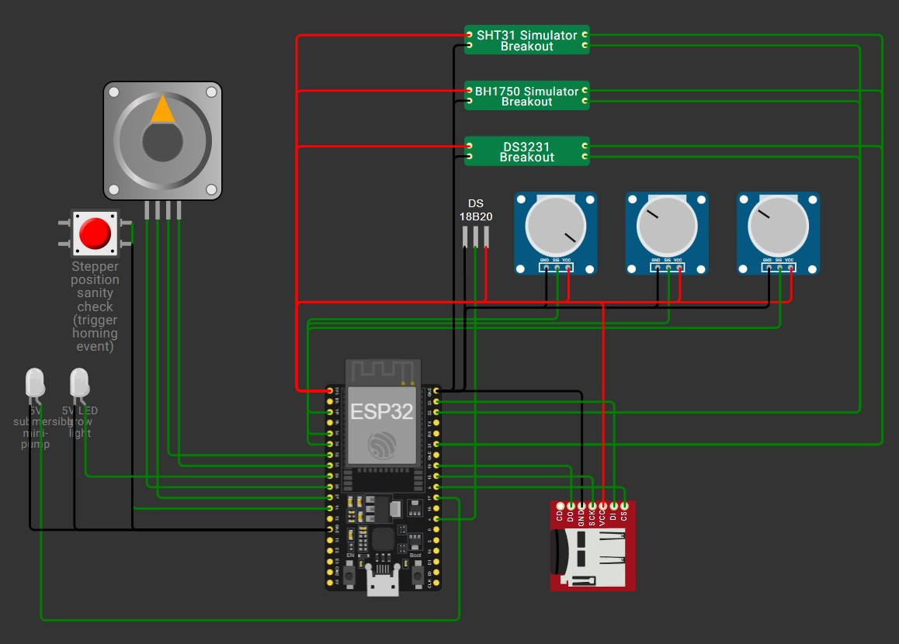

# It That Keeps My Plants Alive

## Introduction

My houseplants met their untimely demise to the hands of not receiving the proper amount of water, so I have come up with a solution. It's a machine that monitors temperature, humidity and light and controls a grow light and water arm to make sure the plants stay alive.

## Wokwi simulation

Before getting any expense, I decided to run this whole thing in a Wokwi simulation that will be linked here:

(Placeholder image, will be replaced by the wokwi web simulation link once completed)

  

## Software architecture
Located in main/

File | Purpose
---|---
main.c | Main
sensors.c | Periodic sampling of moisture/temp/humidity/light
actuators.c | Pump control + RTC-driven light schedule + stepper control
storage.c | CSV to SD card and/or MQTT publish

## Build

- Install ISP-IDF v5.5.5
- In an ESP-IDF terminal, run the commands:
    - idf.py set-target esp32
    - idf.py build

## Hardware

See the Schematic.pdf, here's a breakdown of materials (cost sourced from canadian prices, 2026):

Piece | Function | Cost (pre-tax, CAD)
--- | --- | ---
ESP32-WROOM32E | Main controller | 13$
28BYJ-48 stepper + ULN2003 driver | Motion control | 4$
2x Logic-level MOFSETs | Actuator activation | 2x5$
5V LED grow light | light | 15-20$
5V submersible pump | water | 12$
2x push switches | control | 2$
DS18B20 | Soil temperature sensor | 3x5$
3x Soil moisture sensor | Moisture sensor | 15$
SHT31 | Ambient temperature and humidity sensor | 12-18$
BH1750 | Light sensor | 7$
DS3231 | Power independant time tracking | 7$
MicroSD module + chip | Logging | 14$
3x 10kΩ resistor | Circuits | variable (bulk vs indiv.)
4.7kΩ resistor | Circuits | variable
1μF capacitor | Circuits | variable
Flyback Diode | Circuits | variable
TOTAL | | 137$ + electronics + tx

Tools (testing) | Importance | Cost (pre-tax)
--- | --- | ---
Breadboard kit | Essential | 20$
Extra breadboard | Useful | 8$
Multimeter | Variable | 25$
Perfboard | Essential | 2$
TOTAL | | 22-55$ + tx
